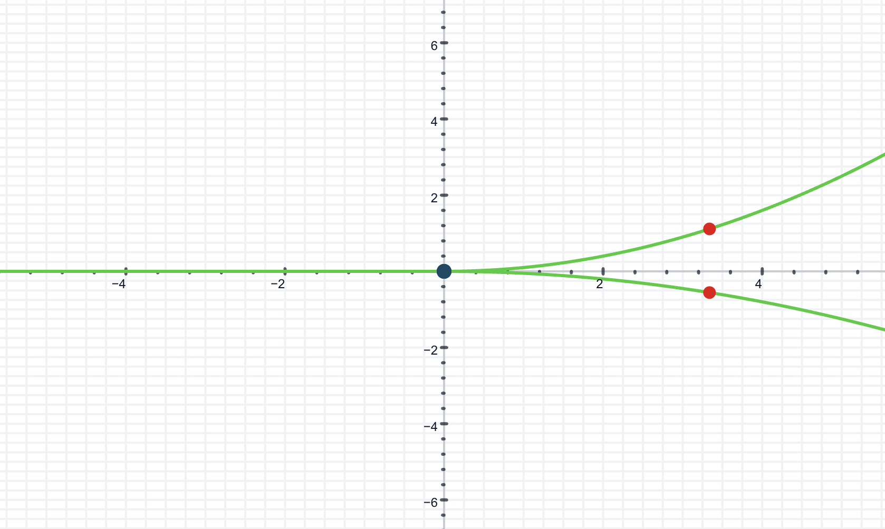
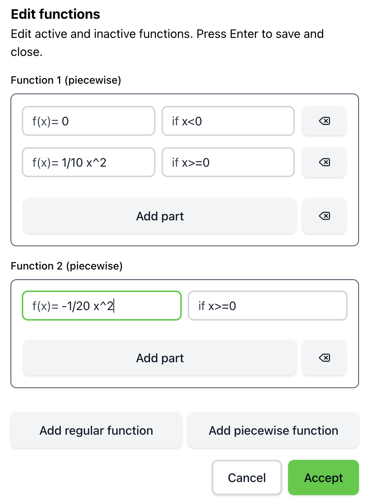

Audiofunctions+ allows users to import and export function definitions and settings using JSON files. This feature is particularly useful for sharing configurations or backing up your work.

## Exporting JSON

To export the current function definitions and settings to a JSON file, follow these steps:

1. Open the command palette by pressing `ctrl+K` (or `cmd+K` on Mac).
2. Type "export" and select the "Export as file" option.
3. A JSON file containing the current configurations will be generated and downloaded to your device.

## Importing JSON

To import function definitions and settings from a JSON file, follow these steps:

1. Open the command palette by pressing `ctrl+K` (or `cmd+K` on Mac).
2. Type "import" and select the "Import from file" option.
3. Choose the JSON file you wish to import from your device.
4. The application will read the file and update the function definitions and settings accordingly.

## JSON file structure

The JSON file used for importing and exporting configurations contains a list of the defined functions and the graph settings. Below is an example of a JSON file structure:

```json
{
  "functions": [
    {
      "id": "f1",
      "functionName": "Function 1",
      "type": "function",
      "functionDef": "sin(x)",
      "isActive": true,
      "instrument": "clarinet",
      "pointOfInterests": [],
      "landmarks": []
    },
    {
      "id": "f2",
      "functionName": "Function 2",
      "type": "piecewise_function",
      "functionDef": [
        [
          "x^2",
          "x <= 0"
        ],
        [
          "x + 1",
          " 0 < x"
        ]
      ],
      "isActive": false,
      "instrument": "clarinet",
      "pointOfInterests": [],
      "landmarks": []
    }
  ],
  "graphSettings": {
    "defaultView": [
      -10,
      10,
      10,
      -10
    ],
    "minBoundDifference": 0.1,
    "maxBoundDifference": 100,
    "showGrid": true,
    "showAxes": true,
    "gridColor": "#CCCCCC",
    "restrictionMode": "none"
  }
}
```

In this example, the JSON file contains two functions: a sine function and a piecewise function. The `graphSettings` section includes various settings for the graph display, such as the default view boundaries and grid visibility.

## Tweaking JSON Files

You can manually edit the JSON file to modify function definitions or graph settings before importing it back into Audiofunctions+.
For instance, you can visualize the following "non-graph" function 



example in the following way. 


Insert the following date in the edit functions menu:

{width="50%"}

Export it to a JSON file as explained above, and then open the JSON file in a text editor. You will see something like this:

```json
{
  "functions": [
    {
      "id": "f1",
      "functionName": "Function 1",
      "type": "piecewise_function",
      "functionDef": [
        [
          "0",
          "x<0"
        ],
        [
          "1/10 x^2",
          "x>=0"
        ]
      ],
      "isActive": false,
      "instrument": "clarinet",
      "pointOfInterests": [],
      "landmarks": []
    },
    {
      "id": "f2",
      "functionName": "Function 2",
      "type": "piecewise_function",
      "functionDef": [
        [
          "-1/20 x^2",
          "x>=0"
        ]
      ],
      "isActive": true,
      "instrument": "clarinet",
      "pointOfInterests": [],
      "landmarks": []
    }
  ],
  "graphSettings": {
    "defaultView": [
      -10,
      10,
      10,
      -10
    ],
    "minBoundDifference": 0.1,
    "maxBoundDifference": 100,
    "showGrid": true,
    "showAxes": true,
    "gridColor": "#CCCCCC",
    "restrictionMode": "none"
  }
}
```

Change the field `isActive` of the first function from `false` to `true`, save the file and import it back into Audiofunctions+ as explained above.

When you activate the sonification, you will hear both functions sonified simultaneously.